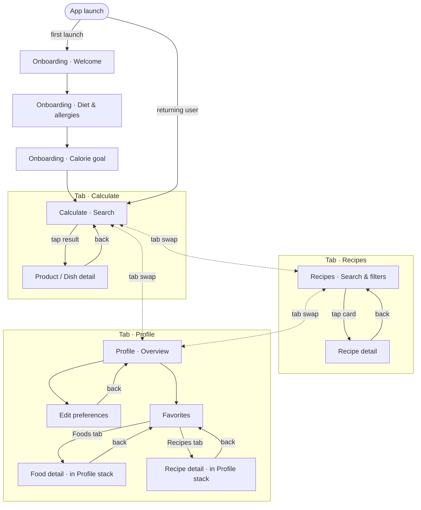

# Calories Calculator — Information Architecture (MVP)

Mobile-first IA for the MVP. Built on the approved structuring plan and user flows. Optimized for the smallest screen set that still serves both user stories, with reusable components called out explicitly.

---

## 1. App Structure (Hierarchy)

A persistent **bottom tab bar** is the spine of the app. Onboarding is a one-time pre-app flow; everything else lives under three tabs.

> **Refinement note:** the original plan listed a separate Home screen with two CTAs. With a bottom tab bar this becomes redundant — the two CTAs are already the two main tabs. Dropping Home keeps MVP leaner. If a landing dashboard is desired later, it can be reintroduced as a 4th tab without breaking this structure.

```
App
├── Onboarding (one-time, pre-app)
│   ├── 1. Welcome
│   ├── 2. Diet & allergies
│   └── 3. Daily calorie goal
│
└── Main app shell  ── [Bottom tab bar: Calculate · Recipes · Profile]
    │
    ├── Tab 1 — Calculate
    │   ├── Search (tab root)
    │   └── Product / Dish detail   (push)
    │
    ├── Tab 2 — Recipes
    │   ├── Search & filters (tab root)
    │   └── Recipe detail   (push)
    │
    └── Tab 3 — Profile
        ├── Profile overview (tab root)
        ├── Edit preferences (push)
        └── Favorites       (push)
```

**Hierarchy rules**
- Each tab owns its own navigation stack — back navigation is per-tab.
- Tabs are siblings; switching tabs does not push or pop, it swaps stacks.
- Detail screens are always children of a search/list screen, never reachable directly from another tab.

---

## 2. Screens Breakdown

### 0. Onboarding (3 steps, swipeable)
- **Purpose:** Capture diet, allergies, and daily calorie goal so recipe search can be personalized from the first session. Skippable.
- **Sections:** Step indicator · question content · primary action · "Skip" link.
- **Key UI elements:** `StepDots`, `PrimaryButton` ("Continue" / "Done"), `SecondaryLink` ("Skip"), `OptionChipGrid` (diet, allergens — multi-select), `NumberInput` with `+ / −` stepper (calorie goal).

### 1. Calculate — Search (tab root)
- **Purpose:** Let the user find any product or dish to calculate calories for.
- **Sections:** Top app bar · search field · recent searches (when query is empty) · results list (when query is non-empty) · empty state (no matches).
- **Key UI elements:** `SearchInput`, `ResultRow` (item name, brand/category, base portion, kcal hint), `RecentSearchRow`, `EmptyState`, `LoadingSkeleton`, `BottomTabBar`.

### 2. Calculate — Product / Dish Detail
- **Purpose:** Show calories and macros for the selected item at the user's chosen portion size.
- **Sections:** Top app bar with back · item header (name, optional image, brand) · portion adjuster · nutrition readout · save action.
- **Key UI elements:** `TopAppBar` (back), `PortionAdjuster` (`NumberInput` + `UnitSelector`: g / pieces / cups / tbsp / serving), `CalorieReadout` (large, prominent), `MacroStrip` (P / C / F), `SaveButton` (toggleable heart/star), `Toast`.

### 3. Recipes — Search & Filters (tab root)
- **Purpose:** Let the user discover recipes that fit their constraints. Profile filters are pre-applied so the default state is already personalized.
- **Sections:** Top app bar · search field · filter chips row · results grid/list of recipe cards · empty state with "Loosen filters" CTA.
- **Key UI elements:** `SearchInput`, `FilterChipRow` (Diet · Allergens · Max calories · Ingredient), `ClearFiltersLink`, `RecipeCard` (image, title, kcal/serving, prep time, `FitsYouBadge`), `EmptyState`, `BottomTabBar`.

### 4. Recipes — Recipe Detail
- **Purpose:** Give the user everything they need to decide on and cook a recipe.
- **Sections:** Hero image · title row with badges · nutrition strip · servings adjuster · ingredients list · steps · save action.
- **Key UI elements:** `TopAppBar` (back), `HeroImage`, `BadgeRow` (`FitsYouBadge`, diet tags), `NutritionStrip` (kcal + P/C/F per serving), `ServingsAdjuster` (`+ / −` stepper), `IngredientList` (qty · unit · name), `StepList` (numbered), `SaveButton`, `Toast`.

### 5. Profile — Overview (tab root)
- **Purpose:** Single place for the user's preferences, goal, and saved items.
- **Sections:** User summary (calorie goal, diet, allergies — read only) · "Edit preferences" entry · "Favorites" entry · "Reset onboarding" link (low-priority).
- **Key UI elements:** `SummaryCard`, `ListItem` rows with chevrons, `BottomTabBar`.

### 6. Profile — Edit Preferences
- **Purpose:** Let the user change diet, allergies, and daily calorie goal at any time.
- **Sections:** Diet section · allergies section · calorie goal section · save action.
- **Key UI elements:** `OptionChipGrid` (reused from Onboarding), `NumberInput` with stepper (reused), `PrimaryButton` ("Save"), `Toast`.

### 7. Profile — Favorites
- **Purpose:** Quick access to saved products/dishes and saved recipes.
- **Sections:** Segmented control (Foods / Recipes) · saved items list · empty state per segment.
- **Key UI elements:** `SegmentedControl`, `ResultRow` (foods — reused from Calculate search), `RecipeCard` (recipes — reused from Recipes search), `EmptyState`.

---

### Reusable components inventory

These show up on more than one screen and should be built once:

| Component | Used on |
|---|---|
| `SearchInput` | Calculate search · Recipes search |
| `ResultRow` (food) | Calculate search · Profile favorites (Foods) |
| `RecipeCard` | Recipes search · Profile favorites (Recipes) |
| `FilterChipRow` / `OptionChipGrid` | Recipes search · Onboarding · Edit preferences |
| `NumberInput` + stepper | Onboarding (calorie goal) · Edit preferences · Servings adjuster · Portion adjuster |
| `UnitSelector` | Portion adjuster (Calculate detail) |
| `NutritionStrip` (kcal + P/C/F) | Calculate detail · Recipe detail |
| `SaveButton` | Calculate detail · Recipe detail |
| `Toast` / `Snackbar` | Any save / error confirmation |
| `EmptyState` | Both search screens · Favorites |
| `TopAppBar` (with back) | All detail / sub-screens |
| `BottomTabBar` | All tab roots |
| `PrimaryButton` / `SecondaryLink` | Onboarding · Edit preferences · CTAs |
| `BadgeChip` (`FitsYouBadge`, diet tags) | Recipe card · Recipe detail |

---

## 3. Navigation Logic

### Entry & exit points
- **First launch:** App → **Onboarding** → on completion (or skip) → **Calculate** tab as the default landing.
- **Subsequent launches:** App → last-used tab (or Calculate by default).
- **Exit:** Standard OS back/home; no in-app exit screen.

### Movement rules
- **Bottom tab bar** is always visible on tab roots (Calculate search, Recipes search, Profile overview). Hidden on detail/sub-screens to maximize content area on small screens.
- **Switching tabs** preserves each tab's stack (so a half-typed search isn't lost when the user peeks at Profile).
- **Push transitions** for all detail screens; **back** returns to the previous list/search.
- **No modals** in MVP. Onboarding is a separate root, not a modal.
- **Cross-tab jumps** are avoided. Tapping a saved Recipe in Profile → Favorites opens the Recipe detail **in the Profile stack**, not the Recipes tab. Same for saved foods. This keeps the back path intuitive ("back where I came from").
- **Toast/snackbar feedback** for save actions — no full-screen confirmations.

### Connection diagram (Mermaid)



### Fallback ASCII map (for environments that don't render Mermaid)

```
                 ┌──────────────────────────┐
                 │      App launch          │
                 └──────────────┬───────────┘
                first launch?  │
              ┌────yes─────────┴───────no────┐
              ▼                              ▼
   [Onboarding 1 → 2 → 3] ──done──▶  ┌─────────────────────────┐
                                     │   Bottom tab bar        │
                                     │  Calculate · Recipes ·  │
                                     │       Profile           │
                                     └──┬───────┬───────┬──────┘
                                        ▼       ▼       ▼
                                    Calculate Recipes Profile
                                       │        │        │
                                  push │   push │    push │
                                       ▼        ▼        ▼
                                   Food      Recipe   Edit prefs
                                  detail     detail    Favorites
                                                        │
                                                  push  ▼
                                              Food / Recipe detail
                                              (in Profile stack)
```

---

## TL;DR

- **3 tabs** (Calculate, Recipes, Profile) + a one-time onboarding flow.
- **7 screens total** in the main app, **3 in onboarding**.
- **Per-tab stacks** with push navigation; no modals.
- **~14 reusable components** carry the entire UI.
- Favorites open inside the Profile stack, never jumping tabs — so back always means "where I just was."
